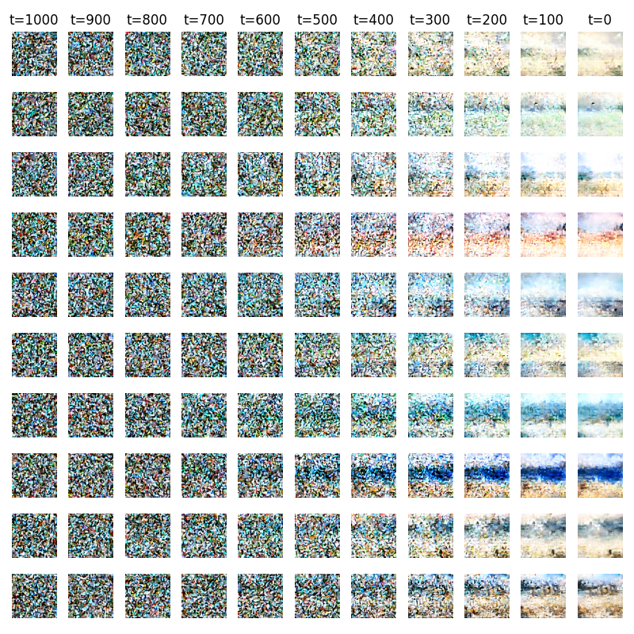

# diffusion_transformer_pytorch



## DiT Task for Mukundan Chariar from IISc Bangalore

### Installation

```bash
pip install -r requirements.txt
```

### Download dataset

```bash
mkdir data
cd data

curl -L -o ./landscape-pictures.zip  https://www.kaggle.com/api/v1/datasets/download/arnaud58/landscape-pictures
unzip ./landscape-pictures.zip
rm ./landscape-pictures.zip

mkdir latent_data
cd latent_data

# download and move file to latent_data
# link: https://drive.google.com/file/d/1u1O0DrS3aiKbLQQIGHg0xHjXEpAKBlgs/view?usp=sharing

unzip ./latent_data.zip
rm ./latent_data.zip
```

### Download weights, configurations, training graphs

- Download from drive link: https://drive.google.com/file/d/1gG9sWpYbbBUiNLxe2q0f2saoIoAdymOm/view?usp=sharing
- Unzip into ./weights
- Directory is structured as:
```
    /weights
        |----- /attention_heads <---- # directory that contains results for experiments relating to attention heads
                    |----- /2_12_1_1000 <---- # 2 patches, 12 layers, 1 attention head, 1000 diffusion timesteps
                                |----- 2_12_1_1000.pt <---- # model weights
                                |----- 2_12_1_1000.json <---- # model config
                                |----- 2_12_1_1000_generated.png <---- # generated images at last timestep v/s real images
                                |----- 2_12_1_1000_losses.png <---- # loss trend visualization
                                |----- score.json <---- # FID score
                                |----- generated_img.png <---- # mosaic of generated images
                                |----- /generated <---- # folder with all ggenerated images
                    ...
```

### Download test data

- Download from drive link: https://drive.google.com/file/d/1HkgKRWm7JWXnB7OBukFF38CtS-HLPPYe/view?usp=sharing
- unzip into ./test_data

### Train and test models yourself

See train.ipynb

### Generate images from FLUX.1-dev and CFG

See sample_pretrained.ipynb

